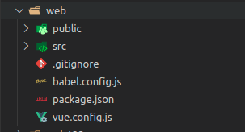
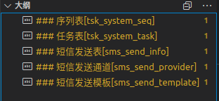
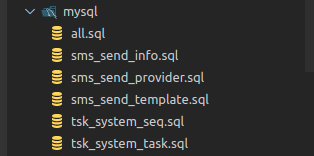
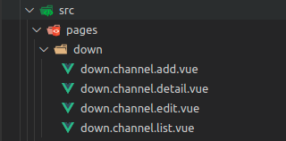
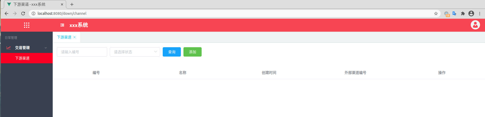
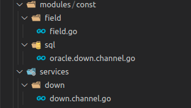
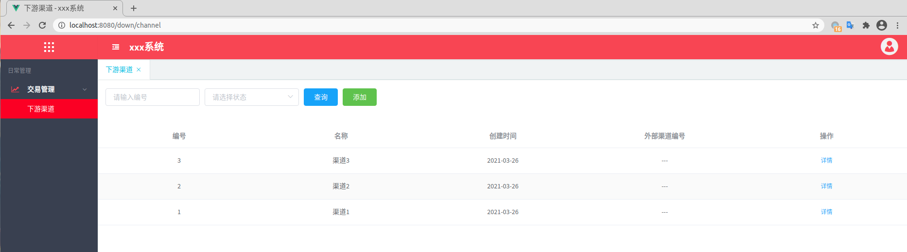
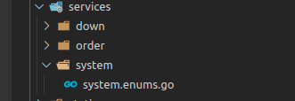

# 介绍
hicli是一个基于hydra框架进行快速开发的工具,它提供：  

> - 通过hicli实现零配置原型超快速开发。
> - 通过hicli实现项目服务的无依赖自动化管理。
> - 通过hicli实现项目仓库的终端化操作。

hicli致力于将hydra生态中的快速开发的基础标准化。它不仅提供了自动化的服务管理，还确保了文档和项目的独立性，这样你可以专注在原型设计和功能开发，而不必纠结于配置、项目搭建以及服务流程处理的问题。

# 安装
```
go get github.com/micro-plat/hicli
go install 
```

#### 查看版本
```
hicli -v
```

# 基础

#### 服务自动化管理  
你可以使用```hicli server run```进行hyra项目的文件变动（添加、删除、修改）进行监控，并自动进行服务的重启
```
用法：hicli server run [options]
选项：
   --fixed, --fd                   -指定服务名称与程序名称相同
   --registry value, -r value      -注册中心地址。格式：proto://host。如：zk://ip1,ip2  或 fs://../
   --plat value, -p value          -平台名称
   --system value, -s value        -系统名称,默认为当前应用程序名称
   --server-types value, -S value  -服务类型，有api,web,rpc,cron,mqc,ws。多个以“-”分割
   --cluster value, -c value       -集群名称，默认值为：prod
   --debug, -d                     -调试模式，打印更详细的系统运行日志，避免将详细的错误信息返回给调用方
   --trace value, -t value         -性能分析。支持:cpu,mem,block,mutex,web
   --tport value, --tp value       -性能分析服务端口号。用于trace为web模式时的端口号。默认：19999
   --mask value, --msk value       -子网掩码。多个网卡情况下根据mask获取本机IP
   --tags value                    -go 安装和打包编译的tags
   --mod value                     -go 安装和打包编译的mod
   --run value                     -应用程序启动参数
   --install value                 -go install参数
   --work, -w                      -以当前路径为工作目录
```

# 搭建
### 注意事项  
 生成文件默认为mysql版本的文件，如需oracle的版本文件，需对hicli进行如下重新安装
 ```
 go install -tags "oracle"
 ```
#### 创建hydra项目
运行以下命令来创建一个hydra项目：
```
hicli app create hello-world
```
  
如需sso集成配置，你可以通过运行以下命令进行添加：  
```
hicli app create hello-world -sso
```  
> ```hicli app create```仅创建了hydra项目所需的基本配置，如需生成服务，可参考创建服务层部分

#### 创建前端vue项目
运行以下命令创建vue项目：
```
hicli ui create web
```
  

#### 创建数据字典
使用```hicli dic create```命令创建数据库对应的数据字典
```
hicli dic create  -db connect_str -cover -f

--dbstr value, --db value  -数据库连接串，参考hydra的db配置时的连接串
--cover, -v                -文件已存在时自动覆盖
--w2f, -f                  -生成到文件
```
> connect_str可参考hydra配置db连接时的连接串  
> oracle格式：oracle:scheme/pwd@orcl136  
> mysql格式：mysql:root:pwd@tcp(192.168.0.36:3306)/scheme  

生成的数据字典结构  
  
生成的数据字典部分内容 
``` 
###  短信发送通道[sms_send_provider]
| 字段名        | 类型         | 默认值 | 为空  | 约束  | 描述                     |
| ------------- | ------------ | :----: | :---: | :---: | :----------------------- |
| provider_id   | bigint(10)   |        |  否   |  PK   | 渠道id                   |
| provider_name | varchar(32)  |        |  否   |       | 渠道名称                 |
| request_url   | varchar(128) |        |  否   |       | 发送地址                 |
| account       | varchar(64)  |        |  否   |       | 账号                     |
| secret        | varchar(128) |        |  否   |       | 密钥                     |
| ext_params    | varchar(256) |        |  是   |       | 参数                     |
| status        | tinyint(1)   |   0    |  否   |       | 状态（0：启用，1：禁用） |
```

#### 创建数据库
使用```hicli db create```命令根据数据字典创建数据库建表sql
```
hicli db create docs/dic.md [outpath] -t "" -d -s -v -g

--gofile, -g             -生成到gofile中
--table value, -t value  -表名称
--drop, -d               -包含表删除语句
--seqfile, -s            -包含序列文件
--cover, -v              -文件已存在时自动覆盖
```
生成的sql文件  
  
生成的sql部分内容  
```
CREATE TABLE  tsk_system_seq (
    seq_id bigint(20)  not null AUTO_INCREMENT  comment '编号' ,
    name varchar(32)  not null  comment '名称' ,
    create_time datetime default CURRENT_TIMESTAMP not null  comment '创建时间' ,
    PRIMARY KEY (seq_id),
    KEY idx_create_time (create_time)
    ) ENGINE=InnoDB  DEFAULT CHARSET=utf8 COMMENT='序列表';
```

# 开发
#### 创建vue项目页面
使用```hicli ui page```创建vue项目的页面文件
```
用法：hicli ui page md文档路径 [输出文件路径] -table [指定表名] -f -cover
选项：
    --table value, -t value  -表名称，多张表以,相隔
    --kw value, -k value     -约束字段
    --w2f, -f                -生成到文件
    --cover, -v              -文件已存在时自动覆盖
```
使用以下数据字典创建页面
```
### 2.下游渠道[oms_down_channel]
| 字段名         | 类型         | 默认值  | 为空  |     约束     | 描述         |
| -------------- | ------------ | :-----: | :---: | :----------: | :----------- |
| channel_no     | varchar2(32) |         |  否   | PK,l,r,SEQ,q | 编号         |
| channel_name   | varchar2(64) |         |  否   |    l,r,c     | 名称         |
| status         | number(1)    |    0    |  否   | R,C,Q,SL,c,r | 状态         |
| create_time    | date         | sysdate |  否   |   l,OB,r,    | 创建时间     |
| ext_channel_no | varchar2(32) |         |  是   |    l,c,r     | 外部渠道编号 |
```
命令：
```sh
> hicli ui page ../docs/db.oracle.md src/pages/ -t oms_down_channel -f -cover  
```
生成页面文件：  
  
同时，在```/src/router/index.js```生成路由：
```
{
    path: 'down/channel',
    name: 'DownChannel',
    component: () => import('../pages/down/down.channel.list.vue')
},
{
    path: 'down/channel/detail',
    name: 'DownChannelDetail',
    component: () => import('../pages/down/down.channel.detail.vue')
},
```
在```public/menus.json```生成菜单
```
  {
    "name": "下游渠道",
    "path": "/down/channel"
  }
```
将菜单加入```public/env.conf.json```的```menus```三级菜单  
```
"menus": [
    {
        "name": "日常管理",
        "path": "-",
        "children": [
            {
                "name": "交易管理",
                "is_open": "1",
                "icon": "fa fa-line-chart text-danger",
                "path": "-",
                "children": [
                    {
                      "name": "下游渠道",
                      "path": "/down/channel"
                    }
                  ]

            }
        ]
    }
]
```
```npm run serve```启动前端服务，效果如图：
  

#### 创建服务层
使用```hicli app service```创建服务层接口
```
用法：hicli app service md文档路径 [输出文件路径] -table [指定表名] --exclude [排除表名] -f -cover

选项：
    --table value, -t value  -表名称，多张表以,相隔
    --kw value, -k value     -约束字段
    --w2f, -f                -生成到文件
    --cover, -v              -文件已存在时自动覆盖
```

使用以下数据字典生成服务层接口
```
### 2.下游渠道[oms_down_channel]
| 字段名         | 类型         | 默认值  | 为空  |     约束     | 描述         |
| -------------- | ------------ | :-----: | :---: | :----------: | :----------- |
| channel_no     | varchar2(32) |         |  否   | PK,l,r,SEQ,q | 编号         |
| channel_name   | varchar2(64) |         |  否   |    l,r,c     | 名称         |
| status         | number(1)    |    0    |  否   | R,C,Q,SL,c,r | 状态         |
| create_time    | date         | sysdate |  否   |   l,OB,r,    | 创建时间     |
| ext_channel_no | varchar2(32) |         |  是   |    l,c,r     | 外部渠道编号 |
```
命令：
```sh
> hicli app service ../docs/db.oracle.md -t oms_down_channel -f -v
```
生成服务层文件：  
  
同时，在```init.go```生成服务接口的注册内容
```
hydra.OnReady(func() {
    hydra.S.Web("/down/channel", down.NewDownChannelHandler())
})
```
启动hydra服务，前端页面即可查询数据：  
  

#### 创建枚举

使用```hicli app enums```创建服务层接口
```
用法：hicli app enums md文档路径 [输出文件路径] -table [指定表名] -f -cover -dds

选项：
   --table value, -t value  -表名称
   --w2f, -f                -生成到文件
   --cover, -v              -文件已存在时自动覆盖
   --dds                    -引用dds
```
使用以下数据字典生成枚举接口
```
### 2.下游渠道[oms_down_channel]
| 字段名         | 类型         | 默认值  | 为空  |     约束     | 描述         |
| -------------- | ------------ | :-----: | :---: | :----------: | :----------- |
| channel_no     | varchar2(32) |         |  否   | PK,l,r,SEQ,q,DI | 编号         |
| channel_name   | varchar2(64) |         |  否   |    l,r,c,DN     | 名称         |
| status         | number(1)    |    0    |  否   | R,C,Q,SL,c,r,DC | 状态         |
| create_time    | date         | sysdate |  否   |   l,OB,r,DC    | 创建时间     |
| ext_channel_no | varchar2(32) |         |  是   |    l,c,r     | 外部渠道编号 |
```
命令：
```sh
> hicli app enums ../docs/db.oracle.md -t oms_down_channel -f -v -dds
```
生成枚举接口文件：  
  
在```services/system/system.enums.go```接口文件中生成的部分内容：
```
var enumsMap = map[string]string{
"down_channel":`select 'down_channel' type, t.channel_no value, t.channel_name name, t.status, t.create_time from oms_down_channel t `,
}
```
在```init.go```生成枚举接口注册：
```
hydra.S.Web("/system/enums", system.NewSystemEnumsHandler())
```
通过该接口，传入```dic_type=down_channel```时,返回结果为
```
[{"create_time":"2021-03-26T16:05:47Z","name":"渠道1","status":"0","type":"down_channel","value":"1"}，  
{"create_time":"2021-03-26T16:05:47Z","name":"渠道2","status":"0","type":"down_channel","value":"2"},  
{"create_time":"2021-03-26T16:05:47Z","name":"渠道3","status":"0","type":"down_channel","value":"3"}]
```
> 生成的枚举接口查询先后顺序：
  - type在enumsMap中，则使用对应sql查询
  - type不在enumsMao中，且引入了dds，则使用dds的sdk进行查询

# 约束配置
> 约束关键字不区分大小写，内容区分大小写  

##### 关键字约束配置

| 约束名  | 说明                                            |                                示例                                 |
| ------- | ----------------------------------------------- | :-----------------------------------------------------------------: |
| PK      | 主键                                            |                                 PK                                  |
| SEQ     | 序列                                            | mysql:SEQ，自增大小为字典的默认值；oracle:SEQ(序列名,起始值,增长值) |
| UNQ     | 唯一索引                                        |                UNQ[(索引名,字段在联合索引中的位置)]                 |
| IDX     | 索引                                            |                IDX[(索引名,字段在联合索引中的位置)]                 |
| C       | 创建数据时的字段                                |                                                                     |
| R       | 单条数据读取时的字段                            |                                                                     |
| U       | 修改数据时需要的字段                            |                                                                     |
| D       | 删除，默认为更新字段状态值为1                   |                           D[(更新状态值)]                           |
| Q       | 查询条件的字段                                  |                                                                     |
| L       | 后端sql查询时的order by字段                     |                                                                     |
| ORDER   | (前端页面)列表里列出的字段;默认降序             |          ORDER[(asc&#124;desc,字段排序顺序)]，越小越先排序          |
| SORT    | 前后端联合排序；默认降序； 不可与ORDER同时使用  |          SORT[(asc&#124;desc,字段排序顺序)]，越小越先排序           |
| DI      | 数据表作为字典数据时的id字段                    |                                                                     |
| DN      | 数据表作为字典数据时的name字段                  |                                                                     |
| SL      | 前端页面下拉框,默认使用dds字典表枚举,可指定表名 |                      SL[(表名&#124;枚举类型)]                       |
| SLM     | 前端页面可多选表单下拉框,默认使用dds字典表枚举  |                      SLM[(表名&#124;枚举类型)]                      |
| CB      | 前端页面复选框,默认使用dds字典表枚举            |                      CB[(表名&#124;枚举类型)]                       |
| RD      | 前端页面单选框,默认使用dds字典表枚举            |                      RD[(表名&#124;枚举类型)]                       |
| TA      | 前端页面文本域                                  |                                                                     |
| CC      | 前端页面状态颜色过滤器                          |                                                                     |
| DATE    | 前端页面日期选择器                              |                                                                     |
| DTIME   | 前端页面日期时间选择器                          |                                                                     |
| FIXED   | 前端页面列表表单固定列                          |                                                                     |
| AFTER   | 前端列表字段在指定字段后面，AFTER(字段名)       |                                                                     |
| REPLACE | 查询替换字符串                                  |     replace(开始位置,倒数结束位置,[替换字符])，替换字符默认为*      |


##### 关键字C,R,U,Q,L约束配置

| 约束名  | 说明                                        |                             示例                   |
| ------- | ------------------------------------------ | :-------------------------------------------------------: |
|  f | 前端字段展示过滤器参数 | L(f:过滤器参数) |
|  e | 枚举参数 |L(e:#字段名),含义为与指定字段为级联枚举；L(e:表名)，含义为指定表枚举；L(e:类型名)，含义为dds指定枚举|


##### 字典表约束配置

| 约束名  | 说明                                        |                             示例                   |
| ------- | ------------------------------------------ | :-------------------------------------------------------: |
|  ^ | 排除表 | 排除渠道表：### 2.下游渠道[^oms_down_channel]|
| el_tab | 生成关联的详情页 | ### 2.下游渠道[oms_down_channel]{el_tab(表名，字段名/字段名，list)}|
| el_index | 生成列表页面的索引 | 索引大小为2，el_index(2)|
| el_btn | 生成页面的按钮操作,多个按钮,以el_btn,el_btn1,el_btn2...顺序配置，最多为10个 |  状态扭转:el_btn(name:方法名,desc:1-禁用&#124;2-启用,confirm:确定要进行此操作吗,key:)<br>关联表数据及数据更新:el_btn(name:方法名,desc:按钮名称,confirm:确定要进行此操作吗,table:关联表:字段1/字段2&#124;关联表2,key:btn_key|
| el_download | 导出excel模板 | el_download(标题1&#124;标题2....)|
| el_select | 列表多选批量操作 |el_select(url:...)|
| el_components | 引入模板 |el_components(名称,文件路径&#124;名称2,文件路径2...)|


# 项目管理 
#### 克隆
运行以下命令进行项目的克隆  
``` 
hicli clone 项目地址
```
```sh
>  hicli clone github.com/micro-plat/hyproxy
git clone https://github.com/micro-plat/hyproxy GOPATH/github.com/micro-plat/hyproxy
```
项目克隆的目录默认为```GOPATH```对应的目录下
> 如果分组下有多个项目，会将分组下所有项目进行克隆
```sh
> hicli clone gitlab.100bm.cn/micro-plat/oms
git clone https://gitlab.100bm.cn/micro-plat/oms/release/lxl/mgrsys/oms-web 
git clone https://gitlab.100bm.cn/micro-plat/oms/release/lxl/mgrsys/oms-api
...
```

#### 拉取
使用以下命令分组下所有项目的指定分支
```
 hicli pull 项目地址 -branch 分支名称
```
```sh
> hicli pull gitlab.100bm.cn/micro-plat/fas -branch dev
get clone https://gitlab.100bm.cn/micro-plat/fas/docs GOPATH/gitlab.100bm.cn/micro-plat/fas/docs
GOPATH/gitlab.100bm.cn/micro-plat/fas/docs > git pull origin dev:dev
....
 ```
 #### 撤销修改
 撤销分组下所有项目的修改  
 ```
 hicli reset 项目目录 -branch 分支名称
 ```
```sh
> hicli reset gitlab.100bm.cn/micro-plat/fas -branch dev
/home/yanglei/work/src/gitlab.100bm.cn/micro-plat/fas/fds > git reset --hard
HEAD 现在位于 1575b23 RPC SDK
/home/yanglei/work/src/gitlab.100bm.cn/micro-plat/fas/fds > git checkout dev
切换到分支 'dev'
/home/yanglei/work/src/gitlab.100bm.cn/micro-plat/fas/fds > git reset --hard
HEAD 现在位于 1575b23 RPC SDK
/home/yanglei/work/src/gitlab.100bm.cn/micro-plat/fas/apiserver > git reset --hard
HEAD 现在位于 420caa3 
/home/yanglei/work/src/gitlab.100bm.cn/micro-plat/fas/apiserver > git checkout dev
切换到分支 'dev'
/home/yanglei/work/src/gitlab.100bm.cn/micro-plat/fas/apiserver > git reset --hard
HEAD 现在位于 420caa3
....
 ```