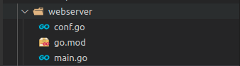

- [介绍](#介绍)
      - [主要功能](#主要功能)
- [安装](#安装)
- [基础](#基础)
    - [一、数据字典](#一数据字典)
    - [二、项目监控重启](#二项目监控重启)
- [生成文件](#生成文件)
    - [一、创建项目](#一创建项目)
      - [1、创建后端项目](#1创建后端项目)
      - [2、创建前端项目](#2创建前端项目)
      - [3、创建数据库表结构](#3创建数据库表结构)
      - [4、目录结构](#4目录结构)
    - [二、生成功能代码](#二生成功能代码)
      - [1. 生成枚举代码](#1-生成枚举代码)
      - [2. 生成列表查询功能](#2-生成列表查询功能)
      - [3. 生成新增、修改功能](#3-生成新增修改功能)
      - [4. 生成详情页面](#4-生成详情页面)
    - [5. 生成详情扩展数据页面](#5-生成详情扩展数据页面)
    - [6. 生成导入导出功能](#6-生成导入导出功能)
- [约束配置](#约束配置)
        - [一、关键字约束配置](#一关键字约束配置)
        - [二、页面展示约束配置](#二页面展示约束配置)
        - [三、字典表约束配置](#三字典表约束配置)
- [项目管理](#项目管理)
      - [一、克隆](#一克隆)
      - [二、拉取](#二拉取)
      - [三、撤销修改](#三撤销修改)

# 介绍
hicli是一个辅助进行快速开发基于hydra框架项目的工具，它不仅提供了服务的监控和重启功能，而且可以自动生成前后端代码，从而不必纠结于配置、项目搭建以及服务流程处理的问题，能够大大减少简单重复工作量。  

#### 主要功能
hicli的主要功能是，根据我们数据字典字段约束配置去生成代码，目前可生成的模块包括：  
- 数据库表结构SQL;
- 基于hydra的后端项目基础文件（conf等）；
- 基于hydra的后端服务层文件（services、modules等）；
- 基于vue的前端项目基础文件（public、main.js等）；
- 基于vue的前端项目页面功能文件（pages、router等）；


# 安装
下载并安装：  
```
go get github.com/micro-plat/hicli
go install 
```
> **提示**  
hicli安装未指定tags时，生成mysql版本的文件；如需oracle版本的文件，如下加入`oracle`标签进行重新安装
 ```
 go install -tags "oracle"
 ```  

更新： 
```
hicli update
```
# 基础
### 一、数据字典

使用hicli进行前后端代码生成前，需要通过markdown编写数据字典。字典格式如下：

```markdown
### 表描述[表名]
| 字段名 | 类型       | 默认值 | 为空  | 约束  | 描述 |
| ------ | ---------- | :----: | :---: | :---: | :--- |
| id     | number(20) |        |  否   |  PK   | 编号 |
```

* 类型：可指定oracle或mysql数据类型，hicli根据生成的数据库自动进行类型转换
* 约束：可指定[约束配置](!)，用于生成数据库主键、索引、前后端代码等

数据字典可生成：  
* 数据库SQL语句，表结构、索引、主键等SQL语句；
* 后端CURD，字典等服务层、SQL语句等代码；
* 前端列表、新增、修改、详情、自定义功能等。

数据字典可手动编写或根据数据库已有表反向生成：
```sh
hicli dic create  -db 数据库连接串 -f ./
```

### 二、项目监控重启  
`hicli server run`提供项目文件变动（添加、删除、修改）监控，当文件发生变化后，自动编译并重启服务。  

在项目根目录下执行：
```sh
hicli server run
```

项目编译或运行时需指定其它参数选项时，可直接追加相应参数选项，如:
```
hicli server run --tags "dev prod" --plat hicli
```
追加的参数将自动传入go install 或 [severName] run 命令

# 生成文件

### 一、创建项目

#### 1、创建后端项目
创建名称为`webserver`的后端项目：

```sh
hicli app create webserver
```
  


#### 2、创建前端项目
进入`webserver`目录创建前端项目：

```sh
hicli ui create web
```
  


#### 3、创建数据库表结构
运行```hicli db create```命令，根据数据字典，创建数据库建表SQL

```markdown
### 用户信息[system_user_info]
| 字段名      | 类型        |      默认值       | 为空  |  约束  | 描述         |
| ----------- | ----------- | :---------------: | :---: | :----: | :----------- |
| id          | int(10)     |                   |  否   | SEQ,PK | 编号         |
| name        | varchar(32) |                   |  否   |  UNQ   | 名称         |
| gender      | int(1)      |                   |  否   |        | 性别 0男 1女 |
| school_id   | int(10)     |                   |  否   |        | 学校         |
| create_time | datetime    | CURRENT_TIMESTAMP |  否   |        | 创建时间     |

### 学校信息[system_school_info]
| 字段名      | 类型        | 默认值 | 为空  |  约束  | 描述     |
| ----------- | ----------- | :----: | :---: | :----: | :------- |
| id          | int(10)     |        |  否   | SEQ,PK | 编号     |
| name        | varchar(32) |        |  否   |  UNQ   | 名称     |
| province_no | varchar(8)  |        |  否   |        | 省份     |
| city_no     | varchar(8)  |        |  否   |        | 城市     |
| address     | text        |        |  是   |        | 扩展信息 |
```
* PK：主键
* SEQ：序列
* UNQ：唯一索引

生成数据库结构
```sh
hicli db create docs/dic.md ./sql -t "" -d -s -v
```

生成后的文件内容如下：  
序列表`seq_ids.sql`:
```sql
    DROP TABLE IF EXISTS seq_ids;
    CREATE TABLE  seq_ids (
    id bigint  not null auto_increment comment '编号' ,
    name varchar(64)  not null  comment '名称' ,
    create_time datetime default current_timestamp not null  comment '创建时间' ,	
    primary key (id)
    ) ENGINE=InnoDB auto_increment = 100 DEFAULT CHARSET=utf8 COMMENT='序列信息表'
```
用户信息表`system_user_info.sql`:
```sql
	DROP TABLE IF EXISTS system_user_info;
	CREATE TABLE IF NOT EXISTS system_user_info (
		id int(10)  not null auto_increment comment '编号' ,
		name varchar(32)  not null  comment '名称' ,
		gender int(1)  not null  comment '性别 0男 1女' ,
		school_id int(10)  not null  comment '学校' ,
		create_time datetime default current_timestamp not null  comment '创建时间' 
		,primary key (id)
		,unique index name(name)
	) ENGINE=InnoDB  DEFAULT CHARSET=utf8mb4 COMMENT='用户信息'
```
学校信息表`system_school_info.sql`:
```sql
	DROP TABLE IF EXISTS system_school_info;
	CREATE TABLE IF NOT EXISTS system_school_info (
		id int(10)  not null auto_increment comment '编号' ,
		name varchar(32)  not null  comment '名称' ,
		province_no varchar(8)  not null  comment '省份' ,
		city_no varchar(8)  not null  comment '城市' ,
		address text    comment '扩展信息' 
		,primary key (id)
		,unique index name(name)
	) ENGINE=InnoDB  DEFAULT CHARSET=utf8mb4 COMMENT='学校信息'
```
#### 4、目录结构
生成的目录结构大致如下：
```  
示例
examples
├─webserver //项目
|     ├─conf.go
|     ├─go.mod
|     ├─main.go
|     ├─web   //基于vue的前端项目
|     |  ├─babel.config.js
|     |  ├─package.json
|     |  ├─vue.config.js
|     |  ├─src 
|     |  |  ├─App.vue
|     |  |  ├─main.js
|     |  |  ├─utility
|     |  |  ├─router
|     |  |  |   └index.js
|     |  |  ├─pages
|     |  |  |   ├─system
|     |  |  |   |   └menus.vue
|     |  ├─public
|     |  |   ├─env.conf.json
|     |  |   └index.html
├─sql //数据库结构sql
|  ├─seq_ids.sql
|  ├─system_school_info.sql
|  └system_user_info.sql
├─docs //数据字典
|  └dic.md
```

### 二、生成功能代码

#### 1. 生成枚举代码
在数据字典的字段约束中增加`DI,DN,DT,DC`等标签

 准备数据字典
```markdown
### 学校信息[system_school_info]
| 字段名      | 类型        | 默认值 | 为空  |   约束    | 描述     |
| ----------- | ----------- | :----: | :---: | :-------: | :------- |
| id          | int(10)     |        |  否   | SEQ,PK,DI | 编号     |
| name        | varchar(32) |        |  否   |  UNQ,DN   | 名称     |
| province_no | varchar(8)  |        |  否   |    DC     | 省份     |
| city_no     | varchar(8)  |        |  否   |    DC     | 城市     |
| address     | text        |        |  是   |           | 扩展信息 |
```
- DI：数据表作为字典数据时的id字段
- DN：数据表作为字典数据时的name字段
- DC：数据表作为字典数据时的查询字段  


在webserver目录下执行生成命令：
```sh
hicli app enums ../docs/dic.md -t system_school_info -f -v -dds
```
生成`./services/system.enums.go`文件，`system_school_info`表对应的枚举获取内容：
```go
var enumsMap = map[string]string{
	"school_info": `select 'school_info' type, t.id value, t.name name, t.province_no, t.city_no from system_school_info t `,
}
```
自动注册枚举获取接口：   
```go
hydra.S.Web("/system/enums", system.NewSystemEnumsHandler())
```

> 生成的枚举接口查询先后顺序：
  - type在enumsMap中，则使用对应表sql查询
  - type不在enumsMao中，且引入了dds，则使用dds的sdk进行查询

#### 2. 生成列表查询功能
在数据字典中添加`L`,`Q`标签  

准备数据字典
```markdown
### 用户信息[system_user_info]
| 字段名      | 类型        |      默认值       | 为空  |            约束            | 描述         |
| ----------- | ----------- | :---------------: | :---: | :------------------------: | :----------- |
| id          | int(10)     |                   |  否   |          SEQ,PK,L          | 编号         |
| name        | varchar(32) |                   |  否   |           UNQ,L            | 名称         |
| gender      | int(1)      |                   |  否   |           L,Q,SL           | 性别 0男 1女 |
| school_id   | int(10)     |                   |  否   | L,Q,SL(system_school_info) | 学校         |
| create_time | datetime    | CURRENT_TIMESTAMP |  否   |             L              | 创建时间     |
```
L：列表展示的字段  
Q：查询条件的字段  
SL: 页面下拉框,默认使用dds字典表枚举,可指定表名  

在`webserver`目录执行服务层生成命令：
```sh
hicli app service ../docs/dic.md -t system_user_info -f -v
```
生成服务层文件：  
  

在web目录下使用命令：
```sh
hicli ui page ../../docs/dic.md src/pages/ -t system_user_info -f -cover
```
生成前端文件：  
    

自动在```web/src/router/index.js```生成路由：
```js
{
    path: 'user/info',
    name: 'UserInfo',
    component: () => import('../pages/user/user.info.list.vue')
},
```

将菜单加入```web/public/env.conf.json```的```menus```三级菜单  
```json
"menus": [
    {
        "name": "日常管理",
        "path": "-",
        "children": [
            {
                "name": "信息管理",
                "is_open": "1",
                "icon": "fa fa-line-chart text-danger",
                "path": "-",
                "children": [
                    {
                        "name": "用户信息",
                        "path": "/user/info"
                    }
                ]
            }
        ]
    }
],
```
启动前后端服务，数据页面展示如下：  


#### 3. 生成新增、修改功能
在数据字典中添加`C`,`U`标签  

准备数据字典
```markdown
### 用户信息[system_user_info]
| 字段名      | 类型        |      默认值       | 为空  |              约束              | 描述         |
| ----------- | ----------- | :---------------: | :---: | :----------------------------: | :----------- |
| id          | int(10)     |                   |  否   |            SEQ,PK,L            | 编号         |
| name        | varchar(32) |                   |  否   |            UNQ,L,C             | 名称         |
| gender      | int(1)      |                   |  否   |            L,Q,SL,U            | 性别 0男 1女 |
| school_id   | int(10)     |                   |  否   | L,Q,C,U,SL(system_school_info) | 学校         |
| create_time | datetime    | CURRENT_TIMESTAMP |  否   |               L                | 创建时间     |
```
- C：创建的字段  
- U：更新的字段

在`webserver`目录重新生成服务层：
```sh
hicli app service ../docs/dic.md -t system_user_info -f -v
```
在`web`目录下重新生成页面：
```sh
hicli ui page ../../docs/dic.md src/pages/ -t system_user_info -f -cover
```
前端进行添加和更新操作：  


#### 4. 生成详情页面

在数据字典中添加`D`标签  

准备数据字典
```markdown
### 用户信息[system_user_info]
| 字段名      | 类型        |      默认值       | 为空  |               约束               | 描述         |
| ----------- | ----------- | :---------------: | :---: | :------------------------------: | :----------- |
| id          | int(10)     |                   |  否   |            SEQ,PK,L,D            | 编号         |
| name        | varchar(32) |                   |  否   |            UNQ,L,C,D             | 名称         |
| gender      | int(1)      |                   |  否   |            L,Q,SL,D,U            | 性别 0男 1女 |
| school_id   | int(10)     |                   |  否   | L,Q,C,D,U,SL(system_school_info) | 学校         |
| create_time | datetime    | CURRENT_TIMESTAMP |  否   |               D,L                | 创建时间     |
```
- R：单条数据的查询字段  

在`webserver`目录重新生成服务层：
```sh
hicli app service ../docs/dic.md -t system_user_info -f -v
```
在`web`目录下重新生成页面：
```sh
hicli ui page ../../docs/dic.md src/pages/ -t system_user_info -f -cover
```
生成前端详情页面：  


### 5. 生成详情扩展数据页面

在对应扩展表的数据字典中添加`D`标签，并在添加表名的约束`el_tab`  

准备数据字典
```markdown
### 用户信息[system_user_info]{el_tab(system_school_info,school_id/id)}
| 字段名      | 类型        |      默认值       | 为空  |               约束               | 描述         |
| ----------- | ----------- | :---------------: | :---: | :------------------------------: | :----------- |
| id          | int(10)     |                   |  否   |            SEQ,PK,L,D            | 编号         |
| name        | varchar(32) |                   |  否   |            UNQ,L,C,D             | 名称         |
| gender      | int(1)      |                   |  否   |            L,Q,SL,D,U            | 性别 0男 1女 |
| school_id   | int(10)     |                   |  否   | L,Q,C,D,U,SL(system_school_info) | 学校         |
| create_time | datetime    | CURRENT_TIMESTAMP |  否   |               D,L                | 创建时间     |

### 学校信息[system_school_info]
| 字段名      | 类型        | 默认值 | 为空  |       约束        | 描述     |
| ----------- | ----------- | :----: | :---: | :---------------: | :------- |
| id          | int(10)     |        |  否   |    SEQ,PK,DI,D    | 编号     |
| name        | varchar(32) |        |  否   |     UNQ,DN,D      | 名称     |
| province_no | varchar(8)  |        |  否   | DC,D(e:province)  | 省份     |
| city_no     | varchar(8)  |        |  否   | DC,D(e:#province) | 城市     |
| address     | text        |        |  是   |         D         | 扩展信息 |
```
- R：单条数据的查询字段  
- e: 页面功能的扩展约束，可指定表名，dds类型或者级联字段名

在`webserver`目录重新生成服务层：
```sh
hicli app service ../docs/dic.md -t system_user_info,system_school_info -f -v
```
在`web`目录下重新生成页面：
```sh
hicli ui page ../../docs/dic.md src/pages/ -t system_user_info -f -cover
```
进入详情，出现关联的学校详情页面：  


### 6. 生成导入导出功能


> **提示**  
hicli根据数据字典的字段约束配置来生成文件，具体约束参考[约束配置]()


# 约束配置
> 约束关键字不区分大小写，内容区分大小写  

##### 一、关键字约束配置

| 约束名  | 说明                                            |                               可选值                                |
| ------- | ----------------------------------------------- | :-----------------------------------------------------------------: |
| PK      | 主键                                            |                                  -                                  |
| SEQ     | 序列                                            | mysql:SEQ，自增大小为字典的默认值；oracle:SEQ(序列名,起始值,增长值) |
| UNQ     | 唯一索引                                        |                UNQ[(索引名,字段在联合索引中的位置)]                 |
| IDX     | 索引                                            |                IDX[(索引名,字段在联合索引中的位置)]                 |
| C       | 创建数据时的字段                                |                                  -                                  |
| D       | 单条数据读取时的字段                            |                                  -                                  |
| U       | 修改数据时需要的字段                            |                                  -                                  |
| DEL     | 删除，默认为更新字段状态值为1                   |                          DEL[(更新状态值)]                          |
| Q       | 查询条件的字段                                  |                                  -                                  |
| L       | 列表展示的字段                                  |                                  -                                  |
| ORDER   | (前端页面)列表里列出的字段;默认降序             |          ORDER[(asc&#124;desc,字段排序顺序)]，越小越先排序          |
| SORT    | 前后端联合排序；默认降序； 不可与ORDER同时使用  |          SORT[(asc&#124;desc,字段排序顺序)]，越小越先排序           |
| DI      | 数据表作为字典数据时的id字段                    |                                  -                                  |
| DN      | 数据表作为字典数据时的name字段                  |                                  -                                  |
| DC      | 数据表作为字典数据时的查询字段                  |                                  -                                  |
| DPID    | 数据表作为字典数据时的PID字段                   |                                  -                                  |
| SL      | 前端页面下拉框,默认使用dds字典表枚举,可指定表名 |                      SL[(表名&#124;枚举类型)]                       |
| SLM     | 前端页面可多选表单下拉框,默认使用dds字典表枚举  |                      SLM[(表名&#124;枚举类型)]                      |
| CB      | 前端页面复选框,默认使用dds字典表枚举            |                      CB[(表名&#124;枚举类型)]                       |
| RD      | 前端页面单选框,默认使用dds字典表枚举            |                      RD[(表名&#124;枚举类型)]                       |
| TA      | 前端页面文本域                                  |                                  -                                  |
| UP      | 文件上传                                        |                                  -                                  |
| EPT     | 导出excel字段                                   |                                  -                                  |
| NOFLTR  | 前端不使用过滤器                                |                                  -                                  |
| CC      | 前端页面状态颜色过滤器                          |                                  -                                  |
| DATE    | 前端页面日期选择器                              |                                  -                                  |
| DTIME   | 前端页面日期时间选择器                          |                                  -                                  |
| DRANGE  | 前端页面日期时间范围选择器                      |              DRANGE[(开始时间往前天数,结束时间往前天数)]                 |
| FIXED   | 前端页面列表表单固定列                          |                                  -                                  |
| AFTER   | 前端列表字段在指定字段后面，AFTER(字段名)       |                                  -                                  |
| REPLACE | 查询替换字符串                                  |     replace(开始位置,倒数结束位置,[替换字符])，替换字符默认为*      |
| DMI     | 前端搜索下拉菜单加输入框联合搜索                |                                  -                                  |
| LINK    | 前端字段链接跳转，默认跳转至当前详情            |                          LINK[(跳转路径)]                           |
| TABL    | 详情tab页面列表字段            |                         -                          |
| TABD    | 详情tab页面字段            |                         -                          |

##### 二、页面展示约束配置
> 该配置是基于L,Q,D,U,C约束配置的扩展

| 约束名 | 说明                                     |                                                       可选值                                                        |
| ------ | ---------------------------------------- | :-----------------------------------------------------------------------------------------------------------------: |
| f      | 前端字段展示过滤器参数，根据字段类型配置 |                                  L(f:小数点位数&#124;字符串截取长度&#124;日期格式)                                  |
| g      | 枚举参数                                 |                         C(g:#字段名),该字段与指定字段为级联枚举,进行自自动填充，并不可更改                          |
| e      | 枚举参数                                 | L(e:#字段名),该字段与指定字段为级联枚举；<br>L(e:表名)，该字段指定表枚举；<br>L(e:dds类型名)，该字段指定dds类型枚举 |


##### 三、字典表约束配置

| 约束名              | 说明                                                                        |                                                                                                           可选值                                                                                                           |
| ------------------- | --------------------------------------------------------------------------- | :------------------------------------------------------------------------------------------------------------------------------------------------------------------------------------------------------------------------: |
| ^                   | 排除表                                                                      |                                                                                       排除渠道表：### 2.下游渠道[^oms_down_channel]                                                                                        |
| el_tab              | 生成关联的详情页                                                            |                                                                                            {el_tab(表名，字段名/字段名，list)}                                                                                             |
| el_index            | 生成列表页面的索引                                                          |                                                                                                  索引大小为2，el_index(2)                                                                                                  |
| el_btn              | 生成页面的按钮操作,多个按钮,以el_btn,el_btn1,el_btn2...顺序配置，最多为10个 | 状态扭转:el_btn(name:方法名,desc:1-禁用&#124;2-启用,confirm:确定要进行此操作吗,key:)<br>关联表数据及数据更新:el_btn(name:方法名,desc:按钮名称,confirm:确定要进行此操作吗,table:关联表:字段1/字段2&#124;关联表2,key:btn_key |
| el_download         | 导出excel模板                                                               |                                                                                             el_download(标题1&#124;标题2....)                                                                                              |
| el_select           | 列表多选批量操作                                                            |                                                                                                     el_select(url:...)                                                                                                     |
| el_components       | 引入列表按钮模板                                                            |                                                                         el_components(名称,文件路径,按钮名称,按钮展示条件&#124;名称2,文件路径2...)                                                                         |
| el_query_components | 引入查询按钮模板                                                            |                                                                            el_query_components(名称,文件路径,按钮名称&#124;名称2,文件路径2...)                                                                             |


# 项目管理 
#### 一、克隆
运行以下命令进行项目的克隆  
``` 
hicli clone 项目地址
```
```sh
>  hicli clone github.com/micro-plat/hyproxy
git clone https://github.com/micro-plat/hyproxy GOPATH/github.com/micro-plat/hyproxy
```
项目克隆的目录默认为```GOPATH```对应的目录下
> 如果分组下有多个项目，会将分组下所有项目进行克隆
```sh
> hicli clone gitlab.100bm.cn/micro-plat/oms
git clone https://gitlab.100bm.cn/micro-plat/oms/release/lxl/mgrsys/oms-web 
git clone https://gitlab.100bm.cn/micro-plat/oms/release/lxl/mgrsys/oms-api
...
```

#### 二、拉取
使用以下命令分组下所有项目的指定分支
```
 hicli pull 项目地址 -branch 分支名称
```
```sh
> hicli pull gitlab.100bm.cn/micro-plat/fas -branch dev
get clone https://gitlab.100bm.cn/micro-plat/fas/docs GOPATH/gitlab.100bm.cn/micro-plat/fas/docs
GOPATH/gitlab.100bm.cn/micro-plat/fas/docs > git pull origin dev:dev
....
 ```
 #### 三、撤销修改
 撤销分组下所有项目的修改  
 ```
 hicli reset 项目目录 -branch 分支名称
 ```
```sh
> hicli reset gitlab.100bm.cn/micro-plat/fas -branch dev
/home/yanglei/work/src/gitlab.100bm.cn/micro-plat/fas/fds > git reset --hard
HEAD 现在位于 1575b23 RPC SDK
/home/yanglei/work/src/gitlab.100bm.cn/micro-plat/fas/fds > git checkout dev
切换到分支 'dev'
/home/yanglei/work/src/gitlab.100bm.cn/micro-plat/fas/fds > git reset --hard
HEAD 现在位于 1575b23 RPC SDK
/home/yanglei/work/src/gitlab.100bm.cn/micro-plat/fas/apiserver > git reset --hard
HEAD 现在位于 420caa3 
/home/yanglei/work/src/gitlab.100bm.cn/micro-plat/fas/apiserver > git checkout dev
切换到分支 'dev'
/home/yanglei/work/src/gitlab.100bm.cn/micro-plat/fas/apiserver > git reset --hard
HEAD 现在位于 420caa3
....
 ```